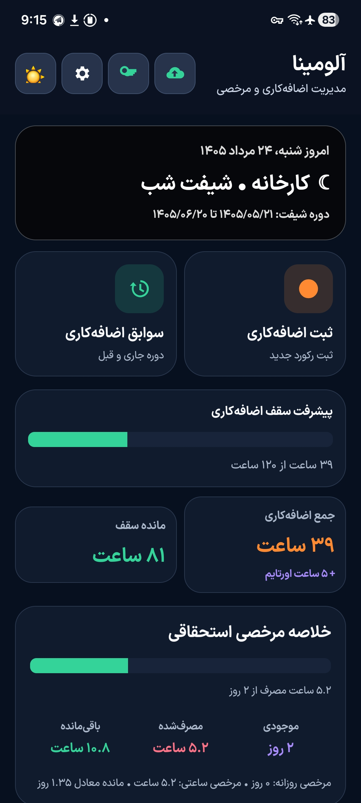
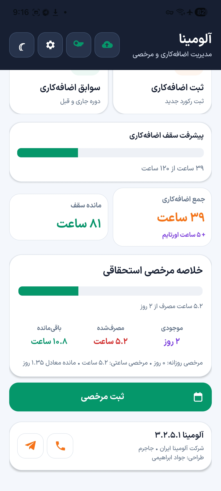
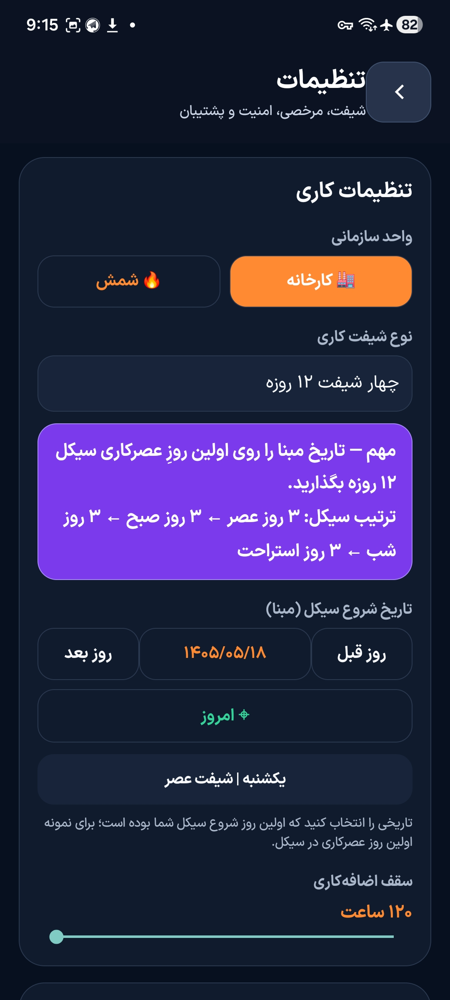

# Alumina

<p align="center">
  <strong>مدیریت هوشمند شیفت، اضافه‌کاری، مرخصی و سوابق پرسنلی</strong>
</p>

<p align="center">
  
  
  
  
</p>

---

## معرفی

**Alumina** یک اپلیکیشن اندرویدی برای مدیریت دقیق برنامه کاری پرسنل، شیفت‌ها، اضافه‌کاری، مرخصی و سوابق دوره‌ای است.

هدف برنامه این است که ثبت اطلاعات روزانه سریع باشد، محاسبات شیفت و اضافه‌کاری با خطای انسانی کمتری انجام شود و کاربر بتواند اطلاعات خود را به‌صورت محلی یا از طریق Google Drive نگهداری و همگام‌سازی کند.

---

## قابلیت‌ها

### مدیریت شیفت
- پشتیبانی از **روزکار**
- پشتیبانی از **دو شیفت هفتگی**
- پشتیبانی از **چهار شیفت**
- پشتیبانی از **پنج شیفت**
- نمایش وضعیت امروز همراه با تاریخ، نوع شیفت و دوره شیفت
- رنگ‌بندی مجزا برای شیفت صبح، عصر، شب و استراحت
- راهنمای انتخاب صحیح تاریخ مبنا برای سیستم‌های ۴ و ۵ شیفت

### ثبت اضافه‌کاری
- ثبت سریع بازه شروع و پایان
- محاسبه خودکار مدت اضافه‌کاری
- کنترل بازه‌های روتین و غیرروتین
- پشتیبانی از قوانین اختصاصی شب‌کاری
- تنظیم پیش‌فرض هوشمند ساعت بر اساس موقعیت روز در سیکل
- نمایش جمع اضافه‌کاری دوره
- نمایش `+ ۵ ساعت اورتایم` برای پرسنل مشمول شیفت

### سوابق اضافه‌کاری
- نمایش سوابق دوره جاری
- جداسازی واضح **سوابق دوره قبل**
- حذف یکجای سوابق دوره قبل
- جلوگیری از حذف اشتباه اطلاعات دوره جاری
- سازگاری حذف‌ها با همگام‌سازی Google Drive

### مدیریت مرخصی
- مرخصی روزانه
- مرخصی ساعتی
- ثبت مرخصی اول وقت و آخر وقت
- پیشنهاد خودکار ساعت فعلی دستگاه هنگام ثبت مرخصی ساعتی
- امکان ویرایش دستی ساعت
- محاسبه موجودی مرخصی
- ثبت مرخصی استحقاقی و سایر انواع مرخصی

### Google Drive
- ورود با حساب Google
- همگام‌سازی اطلاعات بین دستگاه‌ها
- ادغام رکوردها به‌جای جایگزینی ساده اطلاعات
- نگهداری تغییرات محلی تا زمان اتصال دوباره
- Backup و Restore مستقل با فایل JSON

### امنیت
- قفل برنامه با PIN
- نمایش کاملاً مخفی PIN
- ورود با **اثر انگشت**
- پشتیبانی از **تشخیص چهره** در دستگاه‌های سازگار
- قفل خودکار برنامه پس از خروج از محیط برنامه
- جلوگیری از نمایش اطلاعات حساس در Recent Apps و Screenshot در بخش‌های محافظت‌شده

### لایسنس
- دوره آزمایشی
- لایسنس‌های مدت‌دار
- لایسنس دائمی
- اتصال لایسنس به دستگاه
- امکان انتقال یا Reset دستگاه توسط مدیریت
- بررسی آنلاین وضعیت لایسنس
- امکان مسدودسازی لایسنس از سمت مدیریت
- خرید و تمدید از طریق پشتیبانی تلفنی یا تلگرام

### بروزرسانی داخلی
- بررسی وجود نسخه جدید از داخل برنامه
- نمایش Popup هنگام انتشار نسخه جدید
- نمایش شماره نسخه و تغییرات
- دانلود APK بروزرسانی
- پشتیبانی از بروزرسانی اختیاری و اجباری
- مدیریت انتشار نسخه از طریق License Manager

### گزارش فنی
- ثبت خطاهای مهم برنامه
- صف محلی برای گزارش‌های ارسال‌نشده
- ارسال گزارش بعد از برقراری اینترنت
- عدم ارسال اطلاعات حساس مانند رمز، Google Token، محتوای Backup و اطلاعات شخصی رکوردها

### راهنمای تعاملی
- راهنمای زمینه‌ای برای بخش‌های مختلف
- نمایش توضیح در اولین تعامل کاربر با هر قابلیت
- Spotlight شفاف روی کنترل موردنظر
- طراحی نیمه‌شفاف / Glass
- امکان پایان کامل راهنما در هر زمان

---

## طراحی رابط کاربری

رابط کاربری Alumina با تمرکز بر استفاده روزمره طراحی شده است:

- تم روشن و تاریک
- نوارهای پیشرفت ضخیم و خوانا
- دسترسی سریع به تنظیمات، Google Drive و لایسنس
- دکمه‌های اصلی در صفحه نخست
- رنگ‌بندی وضعیت شیفت
- رابط فارسی و راست‌به‌چپ

---

## ساختار صفحات

```text
صفحه اصلی
├── وضعیت شیفت امروز
├── جمع اضافه‌کاری
├── موجودی مرخصی
├── ثبت اضافه‌کاری
├── سوابق اضافه‌کاری
├── ثبت مرخصی
├── Google Drive
├── لایسنس
└── تنظیمات
```

---

## نسخه فعلی

```text
Version Name : 3.2.5.1
Version Code : 61
Package      : com.alumina.app
```

---

## حداقل نیازمندی

- Android 6.0 یا بالاتر
- اتصال اینترنت فقط برای قابلیت‌های آنلاین مانند لایسنس، Google Drive، بررسی بروزرسانی و ارسال گزارش فنی
- قابلیت‌های اصلی ثبت اطلاعات به‌صورت آفلاین نیز قابل استفاده هستند

---

## بروزرسانی

اگر نسخه جدید منتشر شود، Alumina می‌تواند هنگام اجرای برنامه وجود بروزرسانی را بررسی کرده و اطلاعات نسخه جدید را به کاربر نمایش دهد.

برای نصب بروزرسانی، APK جدید باید با **همان Signing Certificate نسخه‌های قبلی** امضا شده باشد.

---

## حریم خصوصی

اطلاعات اصلی برنامه به‌صورت محلی نگهداری می‌شوند و قابلیت‌های آنلاین فقط در صورت استفاده کاربر فعال خواهند شد.

گزارش‌های فنی نیز به‌گونه‌ای طراحی شده‌اند که اطلاعات حساس مانند رمز، Token و محتوای Backup در آن‌ها قرار نگیرد.

---

## پشتیبانی

برای خرید یا تمدید لایسنس، گزارش مشکل یا دریافت راهنمایی:

- **پشتیبانی تلفنی:** `09120929125`
- **Telegram:** [@MrAmooz](https://t.me/MrAmooz)

---

## تصاویر برنامه

<p align="center">
  
  
  
</p>
```

---

## وضعیت پروژه

Alumina در حال توسعه فعال است و قابلیت‌ها بر اساس نیازهای واقعی کاربران و بازخوردهای نسخه‌های عملیاتی بهبود پیدا می‌کنند.

---

## توسعه و طراحی

**طراحی: جواد ابراهیمی**

---

<p align="center">
  <strong>Alumina — ساده‌تر کردن مدیریت شیفت و زمان کاری</strong>
</p>
